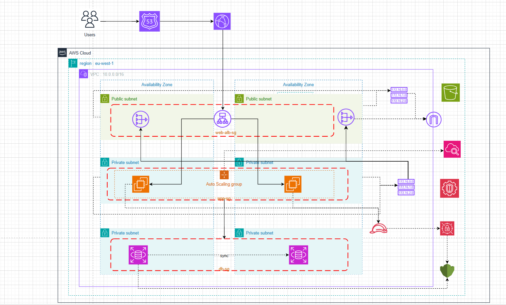

# CloudEngineering_LAB

AWS Well-Architected Framework & Cloud Adoption Framework Assessment Lab — a hands-on exercise designing, evaluating, and deploying a production-ready two-tier web application on AWS.

## Architecture Overview

The solution migrates a legacy on-premises two-tier application (web + database) to AWS using Well-Architected principles across all five pillars: Operational Excellence, Security, Reliability, Performance Efficiency, and Cost Optimization.



### Key AWS Services Used

| Layer | Service | Purpose |
|---|---|---|
| Networking | Amazon VPC, Public & Private Subnets, Internet Gateway, NAT Gateway | Network isolation and segmentation |
| Traffic | Application Load Balancer (ALB), AWS WAF | Distribute and filter inbound traffic |
| Compute | Amazon EC2, Auto Scaling Group | Scalable web-tier instances across two AZs |
| Static Assets | Amazon S3, Amazon CloudFront | CDN-delivered static content |
| Caching | Amazon ElastiCache (Redis/Memcached) | Reduce database read load |
| Database | Amazon RDS Multi-AZ (MySQL/PostgreSQL) | Managed database with automatic failover |
| Security | AWS IAM, AWS KMS, AWS Certificate Manager, Amazon GuardDuty | Least-privilege access, encryption, threat detection |
| IaC & CI/CD | AWS CloudFormation, AWS CodePipeline, AWS CodeDeploy | Reproducible, automated deployments |
| Monitoring | Amazon CloudWatch, AWS CloudTrail, Amazon SNS | Observability, audit logging, and alerting |
| Cost | AWS Budgets, AWS Cost Explorer, AWS Compute Optimizer | Spending visibility and right-sizing |

---

## Prerequisites

Before deploying this lab, ensure you have the following:

- An **AWS account** with sufficient permissions (AdministratorAccess or a scoped IAM role covering the services listed above)
- **AWS CLI** v2 installed and configured (`aws configure`)
- **Git** installed
- Basic familiarity with AWS CloudFormation and the AWS Management Console

### Install the AWS CLI

```bash
# macOS (Homebrew)
brew install awscli

# Linux
curl "https://awscli.amazonaws.com/awscli-exe-linux-x86_64.zip" -o "awscliv2.zip"
unzip awscliv2.zip
sudo ./aws/install

# Windows — download and run the MSI installer from:
# https://awscli.amazonaws.com/AWSCLIV2.msi
```

Verify the installation:

```bash
aws --version
```

### Configure AWS credentials

```bash
aws configure
# AWS Access Key ID:     <your-access-key>
# AWS Secret Access Key: <your-secret-key>
# Default region name:   us-east-1   (or your preferred region)
# Default output format: json
```

---

## Deployment Instructions

### Step 1 — Clone the repository

```bash
git clone https://github.com/AndyDebrah/CloudEngineering_LAB.git
cd CloudEngineering_LAB
```

### Step 2 — Deploy the VPC and Networking Layer

Create the VPC with two public subnets (for the ALB and NAT Gateways) and two private subnets each for the application tier and the database tier, spread across two Availability Zones.

```bash
aws cloudformation deploy \
  --template-file infrastructure/networking.yaml \
  --stack-name cloud-lab-networking \
  --capabilities CAPABILITY_NAMED_IAM \
  --region us-east-1
```

### Step 3 — Deploy Security Groups and IAM Roles

```bash
aws cloudformation deploy \
  --template-file infrastructure/security.yaml \
  --stack-name cloud-lab-security \
  --capabilities CAPABILITY_NAMED_IAM \
  --region us-east-1
```

### Step 4 — Deploy the Database Tier (Amazon RDS Multi-AZ)

This creates an RDS instance in Multi-AZ mode inside the private database subnets with encryption at rest enabled via AWS KMS.

```bash
aws cloudformation deploy \
  --template-file infrastructure/database.yaml \
  --stack-name cloud-lab-database \
  --capabilities CAPABILITY_NAMED_IAM \
  --region us-east-1
```

### Step 5 — Deploy the Caching Layer (Amazon ElastiCache)

```bash
aws cloudformation deploy \
  --template-file infrastructure/cache.yaml \
  --stack-name cloud-lab-cache \
  --capabilities CAPABILITY_NAMED_IAM \
  --region us-east-1
```

### Step 6 — Deploy the Compute Tier (ALB + Auto Scaling Group)

The Auto Scaling Group launches EC2 instances in the private application subnets. The Application Load Balancer sits in the public subnets and forwards HTTPS traffic (via ACM certificate) to the instances.

```bash
aws cloudformation deploy \
  --template-file infrastructure/compute.yaml \
  --stack-name cloud-lab-compute \
  --capabilities CAPABILITY_NAMED_IAM \
  --region us-east-1
```

### Step 7 — Deploy Static Assets (S3 + CloudFront)

```bash
aws cloudformation deploy \
  --template-file infrastructure/cdn.yaml \
  --stack-name cloud-lab-cdn \
  --capabilities CAPABILITY_NAMED_IAM \
  --region us-east-1

# Upload static assets to the S3 bucket created by the stack
BUCKET=$(aws cloudformation describe-stacks \
  --stack-name cloud-lab-cdn \
  --query "Stacks[0].Outputs[?OutputKey=='StaticAssetsBucket'].OutputValue" \
  --output text)

aws s3 sync ./static s3://$BUCKET/ --delete
```

### Step 8 — Deploy the CI/CD Pipeline (CodePipeline + CodeDeploy)

```bash
aws cloudformation deploy \
  --template-file infrastructure/pipeline.yaml \
  --stack-name cloud-lab-pipeline \
  --capabilities CAPABILITY_NAMED_IAM \
  --region us-east-1
```

### Step 9 — Deploy Monitoring and Alerting (CloudWatch + GuardDuty)

```bash
aws cloudformation deploy \
  --template-file infrastructure/monitoring.yaml \
  --stack-name cloud-lab-monitoring \
  --capabilities CAPABILITY_NAMED_IAM \
  --region us-east-1
```

> **Note:** CloudTrail and GuardDuty are enabled at the account level. You will be prompted for an email address to subscribe to SNS alarm notifications.

---

## Verifying the Deployment

1. **Check stack statuses** — all stacks should show `CREATE_COMPLETE`:

   ```bash
   aws cloudformation list-stacks \
     --stack-status-filter CREATE_COMPLETE UPDATE_COMPLETE \
     --query "StackSummaries[?contains(StackName,'cloud-lab')].{Name:StackName,Status:StackStatus}" \
     --output table
   ```

2. **Get the ALB DNS name** and open it in a browser:

   ```bash
   aws cloudformation describe-stacks \
     --stack-name cloud-lab-compute \
     --query "Stacks[0].Outputs[?OutputKey=='LoadBalancerDNS'].OutputValue" \
     --output text
   ```

3. **Confirm RDS Multi-AZ** is active:

   ```bash
   aws rds describe-db-instances \
     --query "DBInstances[*].{ID:DBInstanceIdentifier,MultiAZ:MultiAZ,Status:DBInstanceStatus}" \
     --output table
   ```

4. **View the CloudWatch Dashboard** — navigate to **CloudWatch → Dashboards** in the AWS Console and open the `CloudLabDashboard`.

---

## Tearing Down the Lab

To avoid ongoing charges, delete all stacks in reverse order:

```bash
for STACK in cloud-lab-monitoring cloud-lab-pipeline cloud-lab-cdn \
             cloud-lab-compute cloud-lab-cache cloud-lab-database \
             cloud-lab-security cloud-lab-networking; do
  aws cloudformation delete-stack --stack-name $STACK
  aws cloudformation wait stack-delete-complete --stack-name $STACK
  echo "$STACK deleted"
done
```

---

## Lab Report

The full AWS WAF & CAF Assessment Report (20 pages) is available in [`andy_debrah_aws_lab.pdf`](andy_debrah_aws_lab.pdf).

---

## Author

**Andy Kwasi Debrah** — Cloud Engineering Fundamentals
